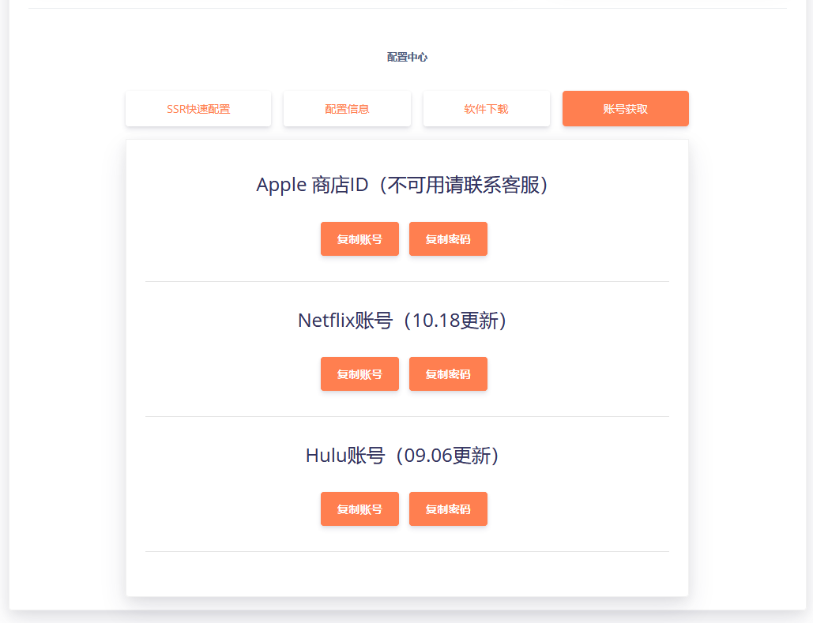

# 可能会问或者以后会问的问题

## Telegram是什么？为什么使用Telegram？如何使用Telegram？ 

### 一、Telegram是什么？ 

答：一款社交聊天工具，你可以理解为发源于俄罗斯的QQ，特点是加密隐私性，并且不接受任何组织和任何国家的信息审查，后面增加了一条规则，如果法官有证据证明你是恐怖分子，会提交你的信息，否则其它情况下，不会提交。

**Telegram**是一个[跨平台](https://zh.wikipedia.org/wiki/%E8%B7%A8%E5%B9%B3%E5%8F%B0)的[即时通信](https://zh.wikipedia.org/wiki/%E5%8D%B3%E6%99%82%E9%80%9A%E8%A8%8A)软件，它的[客户端](https://zh.wikipedia.org/wiki/%E5%AE%A2%E6%88%B7%E7%AB%AF)是[自由及开放源代码软件](https://zh.wikipedia.org/wiki/%E8%87%AA%E7%94%B1%E5%8F%8A%E5%BC%80%E6%94%BE%E6%BA%90%E4%BB%A3%E7%A0%81%E8%BD%AF%E4%BB%B6)，但是它的[服务器](https://zh.wikipedia.org/wiki/%E6%9C%8D%E5%8A%A1%E5%99%A8)是[专有软件](https://zh.wikipedia.org/wiki/%E7%A7%81%E6%9C%89%E8%BD%AF%E4%BB%B6)。用户可以相互交换加密与自毁消息[\[注 1\]](https://zh.wikipedia.org/wiki/Telegram#cite_note-15)，发送[照片](https://zh.wikipedia.org/wiki/%E7%9B%B8%E7%89%87)、[影片](https://zh.wikipedia.org/wiki/%E8%A6%96%E5%83%8F)等所有类型文件。官方提供手机版（[Android](https://zh.wikipedia.org/wiki/Android)、[iOS](https://zh.wikipedia.org/wiki/IOS)、[Windows Phone](https://zh.wikipedia.org/wiki/Windows_Phone)）、桌面版（[Windows](https://zh.wikipedia.org/wiki/Windows)、[macOS](https://zh.wikipedia.org/wiki/MacOS)、[Linux](https://zh.wikipedia.org/wiki/Linux)）和网页版[\[15\]](https://zh.wikipedia.org/wiki/Telegram#cite_note-16)等多种平台客户端；同时官方开放[应用程序接口](https://zh.wikipedia.org/wiki/%E5%BA%94%E7%94%A8%E7%A8%8B%E5%BA%8F%E6%8E%A5%E5%8F%A3)，因此拥有许多第三方的客户端[\[16\]](https://zh.wikipedia.org/wiki/Telegram#cite_note-17)可供选择，其中多款内置中文。

Wiki：[https://zh.wikipedia.org/wiki/Telegram](https://zh.wikipedia.org/wiki/Telegram)

### 二、为什么使用Telegram？ 

答：综上所述，关于言论自由，它更适合。缺点是需要富强，但是你都是能富强了，使用它将不是问题。 详细：[我为什么使用Telegram 即时通讯聊天软件功能对比评测 Telegram VS 国内腾讯系 微信/腾讯QQ](https://saodaye.com/sb/1427.html)

### 三、如何使用Telegram？ 

1. 使用 [Slower](https://slower.wtf) 完成富强后，保持连接状态。
2. 各平台搜索 Telegram ，或者网页访问 [t.me](https://t.me) ,完成软件的下载和安装。
3. 注册账户，+86（即大陆手机号），注册开始使用会无法私聊，需要人工解锁。
4. 软件并没有可以设置中文，但可使用汉化包，开始使用后点击此处解锁： [汉化包](https://t.me/setlanguage/classic-zh-cn)
5. 加入 Slower 群组： [https://t.me/slowerzzz](https://t.me/slowerzzz) , 更多详情请良好心态下群里请教，基础问题本教程看。

PS：各司机群，安卓和PC、网页客户端可畅通浏览，IOS无法访问是因为苹果规定。TG不背锅。

PS：限制大陆手机私聊，并不是因为歧视中国人，而是之前币圈的人各种发广告太严重导致，  
只能用其他手机号注册，比如GV（google voice）虚拟号或者找机器人：[@spambot](https://t.me/spambot) 申请解锁。



## ​什么线路最快？什么线路最好？什么线路最稳定？

一些兄贵进群就**叫嚣**，老子是**尊贵的**5元**VIP**，~~给老子**端**盆洗脚水来~~，告诉老子**最稳定**的线路！  
**奉劝一句，生命**~~诚~~很可贵，**注意**生命安全，**低调点**，不会**就**谦虚求问，不然**很容易**全家出道。

除**测速**以及**挂下载**这类网络行为，**会导致**长时间占用带宽外，**实际使用上**，多机共享**完全够用**。  
**也因为如此**，正常机场才会**很多线路做到10/15一个月**的价格，这比你自己搭建**省心便宜很多**，  
讲句**题外话**，大部分机场都是**亏损和持平状态**，**少部分有富于**，也是真真赚的**体力劳动幸苦钱**。  
  
我们指的**高峰期**是指，**每天18点~23点**，这**六个小时**。因为下班后很多人开**始撸剧看番载片**。  
**为何不存在稳定？**因为我们**并无魔力技能**在你使用的时候**意念控制**大家**不去使用**这条线路。  
人多了**自然**就不稳定**就挤**，给你准备**这么多线路**就是在高峰期**有线可选**，**不至于**脱了裤子**尴尬**。

如果**非要说稳定**，那就是每条线路都是**独享机器独享带宽**，并且根据人数**弹性调整带宽和硬件**。  
**说到底，穷是原罪。若**有人给你如此保证的话，**估计你**会**掏不起**这个钱。**我，没钱，你，给钱。**

## 关于延迟和带宽

**不少兄贵**对延迟和带宽可能都**存在误解**，这里**不做**深入研究，类比为车辆做**简单解释**：

**延迟 = 车速 = 客户端和服务器之间的互相响应速度**  
**带宽 = 车辆可承载人数 = 同一时间内可承载的内容多少**  
**诚然，**延迟越低，带宽越大越好，**醒醒，**虽然二者关系不成反比，**但**是总会**有侧重**。

对于**看网页**，Facebook/Twitter之类网页冲浪，**更看重**延迟，游戏**更甚**，即**车速**。  
对于**看视频**，Netflix/FoxPlus/Hulu/之类在线视频，**更看重**带宽，即**车辆可承载人数**。

因此，**与其问**，什么线路最快，**不如问**，什么线路适合观看视频或者什么线路适合浏览网页。

## 重复**购买**套餐会怎样？时间和流量会叠加吗？不同等级套餐呢？ 

**答：**所有套餐购买，都是除流量外其它属性后者覆盖前者，包括等级和日期等一切属性。

**即，若2015.06.06购买5元套餐**，**到2015.06.26**，**还剩余25G**流量，觉得不错**又购买8.9元套餐**，  
**此时，流量：**150G流量；等级到期**时间：2015.07.26**；**其它**属性**皆覆盖**为**8.9元套餐**属性。

### 为什么？ 

**说起远古时期**的Slower，曾今是有过设定**流量和日期叠加外其它属性后者覆盖前者**的一段时间。  
之后出现一个**小机灵**，**连续购买**11个5元套餐，**最后购买一个**1元流量套餐，**一顿骚操群中秀**，  
**即，5\*11+1=56 得到一年所有节点解锁等级和25\*11=275G流量的骚操作**，我们感到**地大物博人才多后**改为**如今**设定。

## 为什么Slower需要繁琐的订阅操作，而不是像其他VPN一样一键链接使用？ 

答：回答这个问题之前需要给各位小机灵们讲解一下我们所使用的SSR与一键连接的VPN之间的区别与利弊

 **一、什么是vpn**  
vpn在很多人心目中就是用来翻墙的工具，其实不是。vpn最主要的功能，并不是用来翻墙，只是它可以达到翻墙的目的。vpn--虚拟专用网络，它的功能是：在公用网络上建立专用网络，进行加密通讯。在企业网络和高校的网络中应用很广泛。你接入vpn，其实就是接入了一个专有网络，你的网络访问都从这个出口出去，你和vpn之间的通信是否加密，取决于你连接vpn的方式或者协议。  
 ​

**二、什么是ss/ssr**  
ss：ss作者是[clowwindy](https://github.com/clowwindy)，大约两年前，他自己为了翻墙写了shadowsocks，简称ss或者叫影梭，后来他觉得这个东西非常好用，速度快，而且不会被封锁，他就把源码共享在了github上，然后就火了，但是后来作者被请去喝茶，删了代码，并且保证不再参与维护更新。现在这个好像是一个国外的大兄弟在维护。  
  
 ssr：在ss作者被喝茶之后，github上出现了一个叫breakwa11\(破娃\)的帐号，声称ss容易被防火墙检测到，所以在混淆和协议方面做了改进，更加不容易被检测到，而且兼容ss，改进后的项目叫shadowsocks-R，简称ssr，然后ss用户和ssr用户自然分成了两个派别，互相撕逼，直到前阵子，破娃被人肉出来，无奈之下删除了ssr的代码，并且解散了所有相关群组。  
  
 ss和ssr它的原理都是一样的，就是socks5代理，。socks代理只是简单的传递数据包，而不必关心是何种协议，所以socks代理比其他应用层代理要快的多。socks5代理是把你的网络数据请求通过一条连接你和代理服务器之间的通道，由服务器转发到目的地，这个过程中你是没有通过一条专用通道的，只是数据包的发出，然后被代理服务器收到，整个过程并没有额外的处理。通俗的说，现在你有一个代理服务器在香港，比如你现在想要访问google，你的电脑发出请求，流量通过socks5连接发到你在香港的服务器上，然后再由你在香港的服务器去访问google，再把访问结果传回你的电脑，这样就实现了翻墙。

​**三、vpn和ss/ssr的区别和优缺点**  
通过上面的介绍，其实基本已经能看出vpn和ss/ssr的区别了，那么他们到底孰优孰劣。  
  
 因为vpn是走的专用通道，它是用来给企业传输加密数据用的，所以vpn的流量特征很明显，以openvpn为例，更详细的在这里不说了，流量特征明显，防火墙直接分析你的流量，如果特征匹配，直接封掉。目前就翻墙来说，PPTP类型的vpn基本死的差不多了，L2TP大部分地区干扰严重很不稳定。  
  
 ss/ssr的目的就是用来富强的，而vpn的目的是用来加密企业数据的，对于vpn来说安全是第一位的，而对于ss/ssr来说穿透防火墙是第一位，抗干扰性强，而且对流量做了混淆，所有流量在通过防火墙的时候，基本上都被识别为普通流量，也就是说你翻墙了，但是政府是检测不到你在翻墙的。两者的出发点和着重点就不同，ss/ssr更注重流量的混淆加密。  
  
**而安全性方面还要补充的一点就是，目前所有的能在你的手机或电脑上很简单就能找到的一键连接的vpn服务商，都是在使用普通VPN协议来富强，政府是很容易拿到他们的服务器日志的，如果他们真的这样做了，你翻墙做了什么，一览无余。**

#### 综合以上解答，我想各位聪明的小伙伴已经得到了答案

## 购买套餐后的流量是一直可用么？邀请朋友后赠送的呢？能否保留到下月或明年？ 

**答案：不行  
原因：贫穷**

### **醒醒！T1m0R家里**~~**煤矿**~~没矿！ 

**如你所知，**目前本质上讲还是亏本状态中，请原谅我的不严谨，至少也是半公益半持平。  
8.9**元150G**，放在**一般鸡场**已是一个**不可能**定的价格，**特别还是如此**线路**质量**和线路**数量**的情况下，  
**无论是**TG**还是**QQ**还是**WX群中其实**有很多T1m0R好朋友**（机场主），**感谢**不打（**DDOS/CC**）之恩。

如果**非要说到成本**，18.89**元300G（何况又赠送netflix账号）**应该是**正常定价**，**即便这个定价**也很难做到如此线路**质量**和线路**数量**，  
**之所以**定到300G，**是因很多人**其实**用不了**300G，**甚至**3G**也用不了**，**当然**也就有人**需要**的**多一点**，  
那么为了**和谐不纠结**，**干脆都**提到300G，大家也不用**斤斤计较**，**用过**VPN的人就知道**其实都是赚**。

因此**不用觉得**，流量用不完就亏，**别**那么**丢人**。**如果**你**觉得亏**了，**请随时**找权限狗**T1m0R**帮你**清退**。

## 节点失效怎么办？为什么我的SSR或小火箭里的节点比官网中的少或节点不一致？

答：将您软件中的订阅更新即可。

 IOS操作方法：

打开小火箭，按住订阅列表左滑选择更新即可

安卓操作方法：

打开SSR，进入配置文件页，点击右下角加号选择添加升级订阅，然后点击确定并升级即可

## 我他妈白嫖党为什么不能用了？

请您保持您的理智，我们理解白嫖党的不易，所以我们提供了4个相对来说过得去的节点来给各位白嫖党使用。

但！请您理解，我们的服务器及带宽并不是白来的，如果您仅是轻度使用玩家，我们非常建议您白嫖并推荐给其他嫖友，也请您理解我们的规则。

**新注册的白嫖用户默认为2G流量，您需要每天登陆到官网点击签到获取每日免费流量续命。**


不签到怎么续命白嫖？


