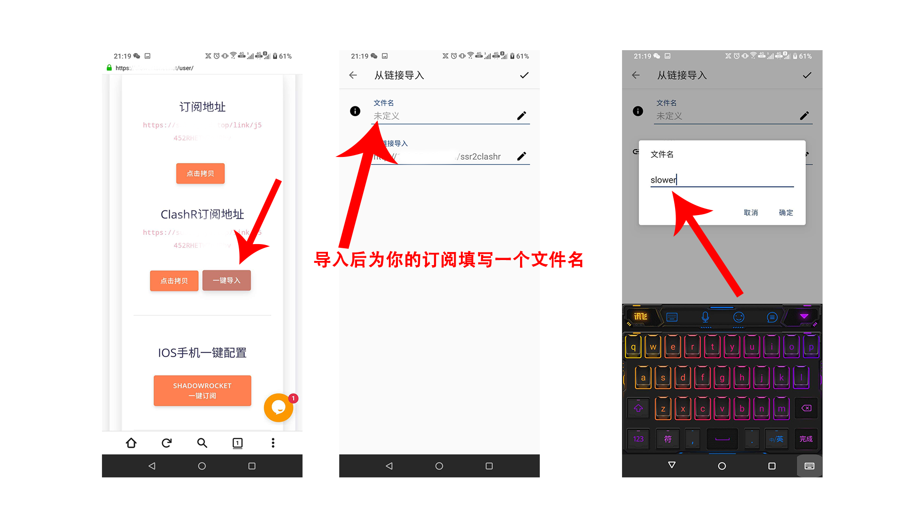

# Android安卓 - ClashR


**如果你不懂SSR原理及订阅使用方法，或无法自行排查SSR的任何错误。** 

**我们已经不建议你使用该客户端** 

\*\*\*\*[**请移步至这里** ](https://down.zjnyd.top/)\*\*\*\*

**安装免配置版客户端使用**。



注意！此客户端仅适用于安卓8.0以上的版本，如果你不知道自己手机的安卓版本可进入如下操作：

打开手机设置 - 找到关于本机 - 查看Android版本即可。


### **第一步：下载并安装ClashR客户端**


[下载ClashR客户端并安装](https://slower.lanzous.com/ibkoqxe)


### 第二步：导入托管链接

首先使用你的账号登陆到slower官网，在用户中心底部找到ClashR订阅地址并点击**一键导入**

### 第三步：返回桌面打开ClashR客户端并选取配置文件

### 第四步：连接使用，及其他操作

### 常见问题

**问：我已经连接了，为什么还是不能用。**

答：1.查看你是否开启了其他的代理工具，如果你正在使用其他代理软件会导致冲突以致不可用

        2.查看第四步，连接后手动切换一个节点尝试。

**问：为什么我的控制面板页面里没有节点可用？**

答：请购买套餐

**问：选择节点页面里有个小闪电的延迟测试图标，我点完测试后就不能用了怎么办？**

答：由于测试延迟会导致你的账号完全使用了这些节点一次，导致你的在线设备数飙升，将会对你的账号进行60秒-180秒左右封禁，请断开连接等待60以上在进行连接使用，所以请不要测试延迟。

