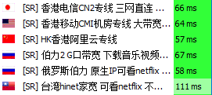
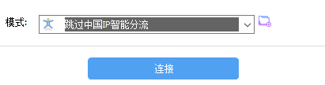
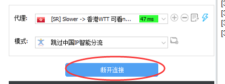

# Windows系统


**如果您使用的系统为Windows XP请点击这里查看教程（这么古老的系统还是放弃吧！）**

**如果您使用的是Windows 7 & Windows 10 请继续查看以下内容**



**下载使用前确保您的系统已安装**[**Microsoft .NET Framework 4.5**](https://www.microsoft.com/zh-CN/download/details.aspx?id=30653)**，如您不确定您的系统是否有此运行库，请在安装完此运行库后在进行以下操作！**


[点击此处下载Slower加速器](https://cdn.lymbb.com/lymbb/Slower_Installer.exe)

下载并打开（如出现以下提示请按图操作）

安装（一直点击下一步并完成即可）

运行程序

输入您的邮箱和密码并点击登陆

登陆成功后如果询问是否安装驱动时选择“是”

 注：软件安装后第一次打开将初始化，若未加载出节点重新打开一次软件即可。  
 如果网站可以正常打开的情况下一直出现“登陆失败”，请安装[Microsoft .NET Framework 4.5](https://www.microsoft.com/zh-CN/download/details.aspx?id=30653)，或将您的操作系统升级至最新的Windows10！

### **选择节点**

 代理选择合适的加速节点\(如何选择合适的节点?\)

### **选择代理模式**

如果您仅需要加速浏览器请选择仅网页加速

如果您需要对所有的程序加速请选择跳过中国IP智能分流

单击闪电图标，测试通过后，点击连接即可开启代理

### **断开连接与退出**

点击断开连接即可停止代理 

下次使用直接打开该软件，选择代理和模式并连接即可。 

然后直接关闭程序即可

